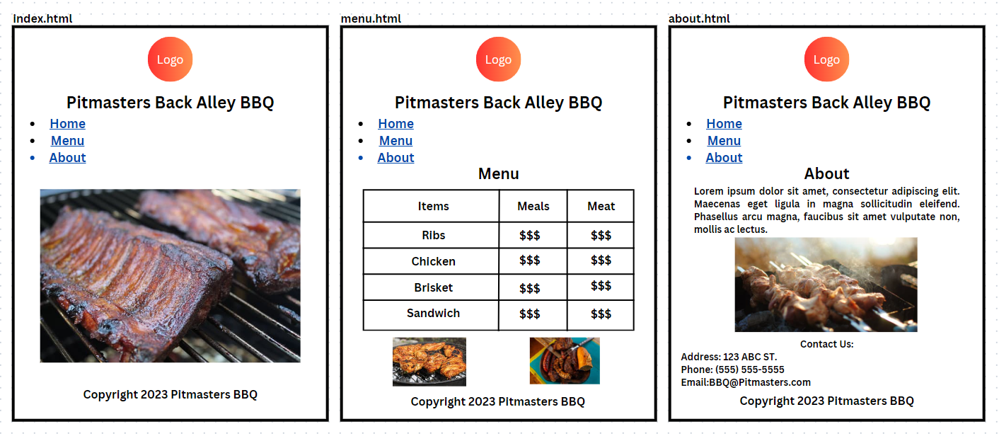

<h2>About</h2>
  

  This is my first HTML assignment based off of building a fake E-Commerce Website. It's loosely modeled after the real restaurant Pitmasters Back Alley BBQ. It has three pages - home, menu, and about. It features a table with fictitous prices and contact information. It also includes images on each page.
  

<h2>Wireframe</h2>
  

  This is my plan for the website without using CSS. The wireframe was created on Canva.com
  

<h2>Technology used</h2>
  

  The project uses HTML to structure the website.
  

<h2>Credits and Acknowledgements</h2>
  

  Images were mostly copied from google.com and the Pitmasters website.
   
  Parts of the HTML were refrenced from MDN.
  

<h2>Photo Credits</h2>
  

    Logo: <a href="https://www.pitmastersbackalleybbq.com/">https://www.pitmastersbackalleybbq.com/</a>
  

<h2>Code Credits</h2>
  

    Image tag: <a href="https://developer.mozilla.org/en-US/docs/Web/HTML/Element/img">MDN Image Element</a>
  

  

    Unordered List: <a href="https://developer.mozilla.org/en-US/docs/Web/HTML/Element/ul">MDN UL Element</a>
  
